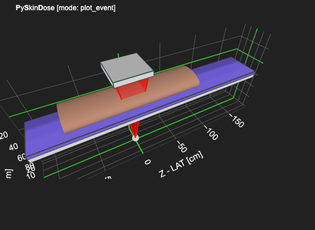
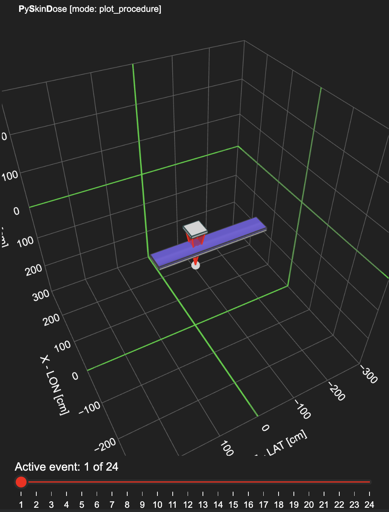
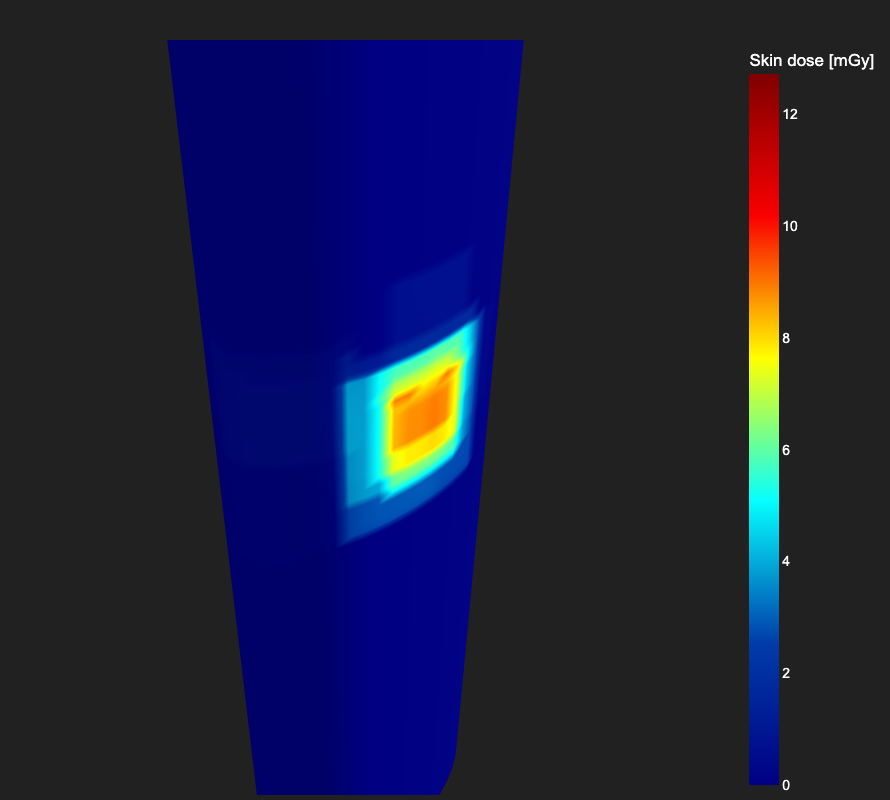

# Getting Started with PySkinDose

## Importing PySkinDose

After installing PySkinDose, it can be imported into a Python file as follows:
```python
import pyskindose as psd
```

## Example Data
Example RDSR data to test PySkinDose with is available in the [example_data/RDSR](https://github.com/rvbCMTS/PySkinDose/tree/master/src/pyskindose/example_data/RDSR) directory on GitHub.

## Settings
Copy [settings_example.json](https://github.com/rvbCMTS/PySkinDose/blob/master/src/pyskindose/settings_example.json) and save it as settings.json. Set all your parameters in this file, including the mode in which you want to run PySkinDose. See the [pyskindose.settings](https://pyskindose.readthedocs.io/en/latest/pyskindose.settings.html) subpackage documentation for a description of all the parameters. By default, the settings are set to run plot_event mode.

## Running PySkinDose with an RDSR DICOM file

The [pyskindose.main](https://pyskindose.readthedocs.io/en/latest/pyskindose.html#module-pyskindose.main) module contains the main method, a script that parses an RDSR DICOM file according to the settings provided, producing the specified output. 

To run the script, first load settings.json into a Python dictionary: 
```python
import json
with open('settings.json') as f:
        settings = json.load(f)
```

Then import main and call it with your data and settings:
```python
import pyskindose.main as psd_main
rdsr_file = 'siemens_axiom_example_procedure.dcm'
psd_main.main(rdsr_file, settings)
```

When run using the example settings with the example [siemens_axiom_example_procedure.dcm](https://github.com/rvbCMTS/PySkinDose/blob/master/src/pyskindose/example_data/RDSR/siemens_axiom_example_procedure.dcm) RDSR data as above, the program produces this output, plotting the geometry for the specified irradiation event:



## plot_procedure Mode

The PySkinDose plot_procedure execution mode plots geometry of the entire sequence of RDSR events provided in the RDSR file. To use plot_procedure mode setting.json must be modified to indicate so:
```json
{
        "mode": "plot_procedure",
        "rdsr_filename": "siemens_axiom_example_procedure.dcm",
        ...
}
```

Running the main script as above produces the following plot with a slider at the bottom to view the sequence of RDSR events recorded during the procedure:



## calculate_dose Mode

The PySkinDose calculate_dose execution mode calculates the skindose from the RDSR data and presents the result in a skindose map, a interactive visual indication of skin dose.

### How Peak Skin Dose is Calculated
The basic equation for estimating skin dose is as follows:

$D_{skin} = K\times k_{isq}\times k_{BS}\times k_{f}\times k_{(T+P)}$

where
- $K$ is the air kerma at the patient entrance reference point,
- $k_{isq}$ is the correction for source to skin distance,
- $k_{bs}$ is the correction for back scatter,
- $k_{f}$ is the correction for kerma in a medium different from air, and
- $k_{(T+P)}$ is the correction for tabletop and pad attenuation and forward scatter.

The [pyskindose.calculate_dose](https://pyskindose.readthedocs.io/en/latest/pyskindose.calculate_dose.html#) subpackage contains the functions used to calculate the skin dose. Provided the position and orientation of the phantom, X-ray beam, tabletop, and pad according to the procedure's RDSR data, the following algorithm is applied to calculate the skin dose from a single irradiation event:

- For each skin patch:
  - If the skin patch is hit:
    - Calculate if tabletop and pad correction are needed
    - Calculate correction factors
    - Calculate the skin dose for the patch
    - Add result to the skin dose map

This algorithm can be recursively called on each event in the procedure to generate the final skin dose map, where the results of the calculations can be viewed:


To find out more about how this algorithm is implemented in PySkinDose, see the [calculate_dose implementation](https://github.com/rvbCMTS/PySkinDose/tree/master/src/pyskindose/calculate_dose) on GitHub. To read more about how skin dose is calculated, including the corrections necessary, read [this paper](https://aapm.onlinelibrary.wiley.com/doi/10.1002/mp.14910) published by Jonas Andersson et al.

### HVL Data
To use the calculate_dose mode, a HVL table is needed. The PySkinDose [table_data](https://github.com/rvbCMTS/PySkinDose/tree/master/src/pyskindose/table_data) module contains functionality to generate the required tables. To generate an HVL table for a specific filter and anode angle, the [generate_hvl_data](https://github.com/rvbCMTS/PySkinDose/blob/master/src/pyskindose/table_data/generate_hvl_data.py) script can be called. Then, the [build_hvl_table](https://github.com/rvbCMTS/PySkinDose/blob/master/src/pyskindose/table_data/build_hvl_table.py) script can be modified and called to combine the necessary tables into hvl_combined.csv. 

To access these functions, the table_data module can be cloned to your working directory. HVL tables for the provided example RDSR data, including [hvl_combined.csv](https://github.com/rvbCMTS/PySkinDose/blob/master/src/pyskindose/table_data/hvl_tables/hvl_combined.csv), are available in the table_data directory.

### Installing ipywidgets
The ipywidgets package is needed to display the progress bars when running calculate_dose mode. The package must first be installed:
```terminal
pip install ipywidgets
```

Then enabled:
```terminal
jupyter nbextension enable --py widgetsnbextension --sys-prefix
jupyter nbextension install --py widgetsnbextension --sys-prefix
```
After installing and enabling the package, the kernel must be restarted for the changes to take effect.

### Producing the Skindose Map
After building hvl_combined.csv and installing ipywidgets, change the execution mode to calculate dose in your settings file and the plot setting plot_dosemap to true: 
```json
{
        "mode": "calculate_dose",
        "rdsr_filename": "siemens_axiom_example_procedure.dcm",
        ...
        "plot": {
            "dark_mode": true,
            "plot_dosemap": true,
            ...
        },
        ...
}
```

Now, calling main as shown produces this output, calculating the skindose from the RDSR data and presenting the result in a skindose map:



## Running PySkinDose as a Scriptable Interface
The PySkinDose library also provides functionality for users who need more customization. To use this functionality, the raw RDSR file must first be parsed, then normalized.

### Creating a pyskindose_settings Object
The [pyskindose.settings](https://pyskindose.readthedocs.io/en/latest/pyskindose.settings.html#) subpackage contains the [pyskindose_settings](https://pyskindose.readthedocs.io/en/latest/pyskindose.settings.html#module-pyskindose.settings.pyskindose_settings) module, allowing for the settings needed to run PySkinDose and the normalization settings needed to normalize the data to be contained within a single Python object. 

Example normalization settings can be found on GitHub in [normalization_settings.json](https://github.com/rvbCMTS/PySkinDose/blob/master/src/pyskindose/normalization_settings.json).

After loading the settings PySkinDose settings as shown previously, they can be combined with the loaded normalization settings as such:
```python
from pyskindose.settings import pyskindose_settings
with open('normalization_settings.json', 'r') as f:
        normalization_settings = json.load(f)
settings_object = pyskindose_settings.PyskindoseSettings(settings=settings, normalization_settings=normalization_settings)
```

### Parsing an RDSR DCM File
The [rdsr_parser](https://pyskindose.readthedocs.io/en/latest/pyskindose.html#module-pyskindose.analyze_data) method parses a provided pydicom FileDataset containing RDSR data. To load your RDSR data as a pydicom FileDataset, the pydicom package is needed:
```python
import pydicom as dicom
dcm_file = dicom.dcmread('siemens_axiom_example_procedure.dcm')
```

Then rdsr_parser can be called to return the data as a Pandas DataFrame:
```python
parsed_rdsr = psd.rdsr_parser(dcm_file)
```

### Normalizing RDSR Data
The [rdsr_normalizer](https://pyskindose.readthedocs.io/en/latest/pyskindose.html#module-pyskindose.analyze_data) module normalizes the parsed RDSR data with the normalization settings provided, and returns the normalized data in a new DataFrame:
```python
normalized_rdsr = psd.rdsr_normalizer(parsed_rdsr, settings_object)
```

### Analyzing the Data
To analyze the parsed and normalized RDSR data, the [analyze_data](https://pyskindose.readthedocs.io/en/latest/pyskindose.html#module-pyskindose.analyze_data) module can be used. Similar to the main script, analyze_data runs PySkinDose in the desired mode, specified in the settings provided. However, analyze_data returns a dictionary, containing calculation specifics when run in calculate_dose mode:
```python
results = psd.analyze_data(normalized_rdsr, settings_object)
```

This dictionary can be printed to view hits, dose map, correction factors, etc.:
```
>>> print(results)
{'hits': [[False, False, ...
```

To learn more about the PySkinDose library and what it can do, take a look at the [official documentation](https://pyskindose.readthedocs.io/en/latest/modules.html).